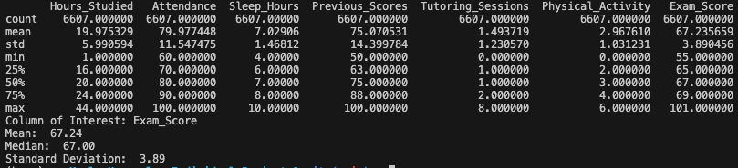

# IDS 706: Individual Project 1

## Continous Integration using Github Actions of Python Data Science Project
### Kayla Haeussler

The purpose of this assignment was to create a  Python template to be used for future projects with best practices in place for testing, development and deployment.


# Assignment Requirements
* __`Jupyter Notebook`__ with:
  - Cells that perform __descriptive statistics using Polars or Panda__
  - Tested by using __nbval plugin__ for __pytest__
*	__`Python Script`__ performing the same descriptive statistics using Polars or Pandas
* __`lib.py`__ file that shares the common code between the script and notebook
* __`Makefile`__ with the following:
  - Run all tests __(must test notebook and script and lib)__
  - Formats code with __Python Black__
  - Lints code with __Ruff__
  - Installs code via:  __pip install -r requirements.txt__
*	__`test_script.py`__ to test script
*	__`test_lib.py`__ to test library
*	Pinned __`requirements.txt`__
*	__`GitHub Actions`__ performs all four Makefile commands with __badges__ for each one in the `README.md`

# Project Directory
```
Kayla_Haeussler_Individual_Project_1/
├── __pycache__/
├── .devcontainer/
│   ├── devcontainer.json
│   └── Dockerfile
├── .github/
│   └── workflows/
│       ├── format.yml
│       ├── install.yml
│       ├── lint.yml
│       └── test.yml
├── Functionb_output_Images/
│      └── Summary_statistics.png
├── mylib/
│      ├── __init__.py
│      └── calculator.py
├── .gitignore
├── Dockerfile
├── main.ipynb
├── main.py
├── Makefile
├── README.md
├── repeat.sh
├── requirements.txt
├── StudentPerformanceFactors.csv
├── test_lib.py
└── test_main.py
```
# Project Structure


# Data Set Used in this Project
The data set used in this project, StudentPerformanceFactors.csv, was pulled from kaggle.com, a website offering public domain data sets. This data is described as a "comprehensive overview of various factors affecting student performance in exams", including data for 6,607 students's grade on a final exam as well as information on various factors that may affect their exam performance, such as # of hours studied, percentage of classes attended, parental involvement (Low, Medium, High), and many others.

# Example Summary Statistics
Example output generated by the get_summary_stats function in main when the column of interest is "Exam_Score"



# Example Data Visualizations
Histogram of final exam scores generating using the create_scatter function in main.py


Scatter plot demonstrating the relationship between hours studied and the final exam score received


# References
https://github.com/nogibjj/python-ruff-template